# PREVIEW  
*Purdue Rocket Experimental Video in Educational Work*

## Project Overview

**PREVIEW** is a student-led aerospace project focused on developing a self-contained payload capable of collecting sensor data and capturing video footage of a rocket’s exterior during hypersonic flight. The launch provider for this mission is **PLUTO Aerospace**. During flight, the payload is designed to withstand impulse accelerations of up to **150 g**.

During fall 2025, our team manufactured the aluminum wedge structures, finalized, fabricated, and assembled the printed circuit board (PCB) through **OSH Park**, and developed the launch and data acquisition software.

## Technical Description

The payload is built around a **Raspberry Pi Zero** microcontroller paired with a **Pi Camera**, enabling video capture of the rocket’s exterior surface. The sensor suite includes:

- **Two pressure transducers** to measure at the body and wedge, enabling Mach number estimation  
- An **ADXL375 accelerometer** for high-G acceleration measurements  
- A **K-type thermocouple** with a **MAX31855** breakout board for internal temperature monitoring  

Synchronized sensor data and video footage are used to evaluate the performance of a material applied to the rocket’s exterior under hypersonic conditions.

All electronic components are housed within a custom circular structural frame designed in CAD. The system stacks batteries, the microcontroller, and sensors across multiple disks separated by spacers, reducing mechanical stress during high-G launch events. Power is supplied by two **9V NiMH batteries**, regulated down to **5V** for onboard electronics.

## My Role  
*January 2025 – October 2025*
- System design considerations for electronics.
- Improved Solidworks CAD protoypes.
- PCB protoyping with breadboard and aided with Fusion 360 PCB layouts.
- Improved Python scripts for launch sequence control and sensor data acquisition.
- Configured Raspberry Pi to enable WiFi power management and auto-run launch software on power-up using systemd service files.

## Design Overview

  <figure style="flex: 1 1 300px; max-width: 400px;">
    
    <figcaption style="text-align: center;">Camera Front Wedge</figcaption>
  </figure>
  <figure style="flex: 1 1 300px; max-width: 400px;">
    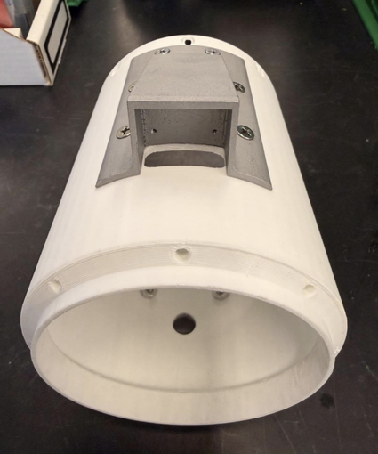
    <figcaption style="text-align: center;">Camera Bottom Wedge</figcaption>
  </figure>
  <figure style="flex: 1 1 300px; max-width: 400px;">
    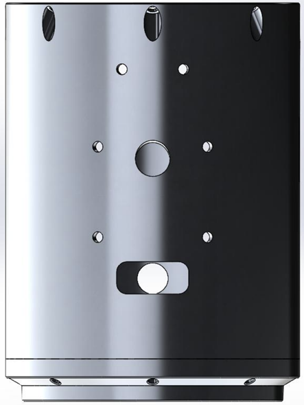
    <figcaption style="text-align: center;">CAD Camera Front Wedge</figcaption>
  </figure>
  
  <figure style="flex: 1 1 300px; max-width: 400px;">
    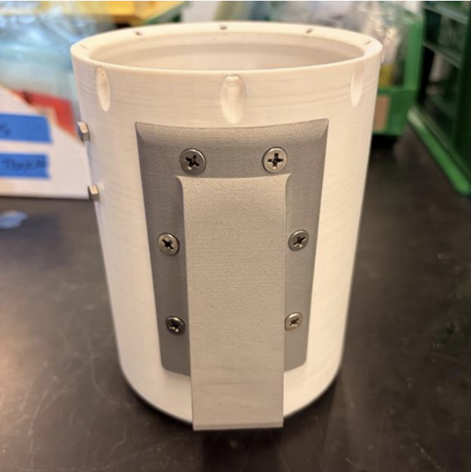
    <figcaption style="text-align: center;">Toggle Front Wedge</figcaption>
  </figure>
  <figure style="flex: 1 1 300px; max-width: 400px;">
    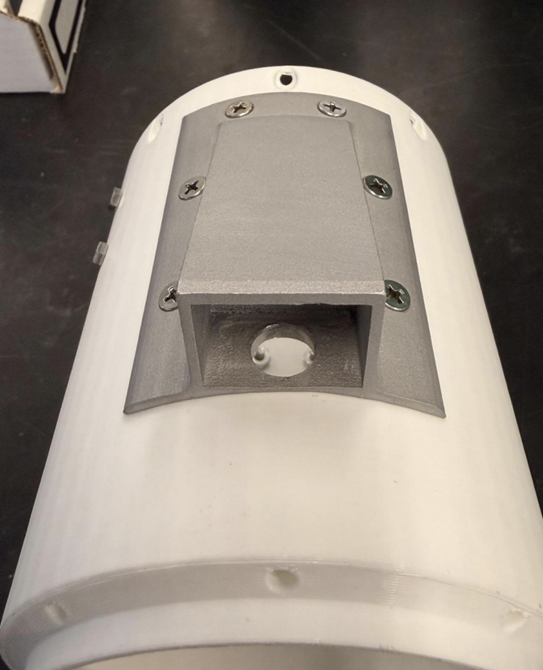
    <figcaption style="text-align: center;">Toggle Bottom Wedge</figcaption>
  </figure>
  <figure style="flex: 1 1 300px; max-width: 400px;">
    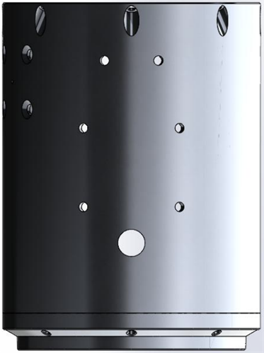
    <figcaption style="text-align: center;">CAD Toggle Front Wedge</figcaption>
  </figure>
  
  <figure style="flex: 1 1 300px; max-width: 400px;">
    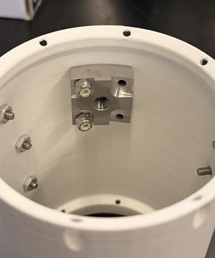
    <figcaption style="text-align: center;">Payload Frame Inside</figcaption>
  </figure>
  <figure style="flex: 1 1 300px; max-width: 400px;">
    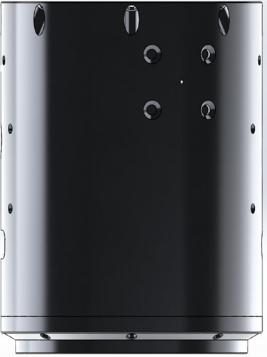
    <figcaption style="text-align: center;">CAD Payload Frame Outside</figcaption>
  </figure>
  <figure style="flex: 1 1 300px; max-width: 400px;">
    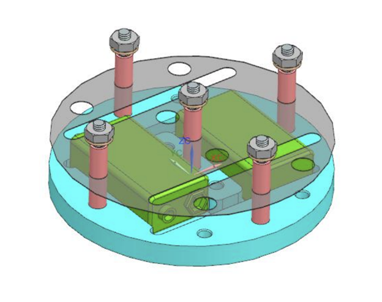
    <figcaption style="text-align: center;">CAD Battery Layout</figcaption>
  </figure>
  
  <figure style="flex: 1 1 300px; max-width: 400px;">
    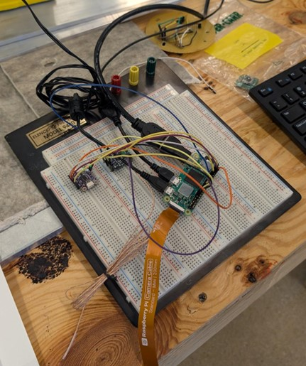
    <figcaption style="text-align: center;">Breadboard Early Prototype (Temp & Accel)</figcaption>
  </figure>
  <figure style="flex: 1 1 300px; max-width: 400px;">
    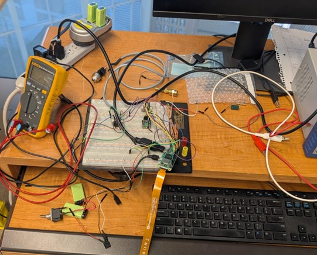
    <figcaption style="text-align: center;">Breadboard Final Prototype (Temp, Accel, Pressure, Batteries)</figcaption>
  </figure>
  <figure style="flex: 1 1 300px; max-width: 400px;">
    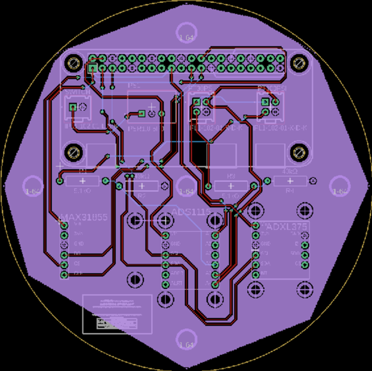
    <figcaption style="text-align: center;">PCB Design</figcaption>
  </figure>

