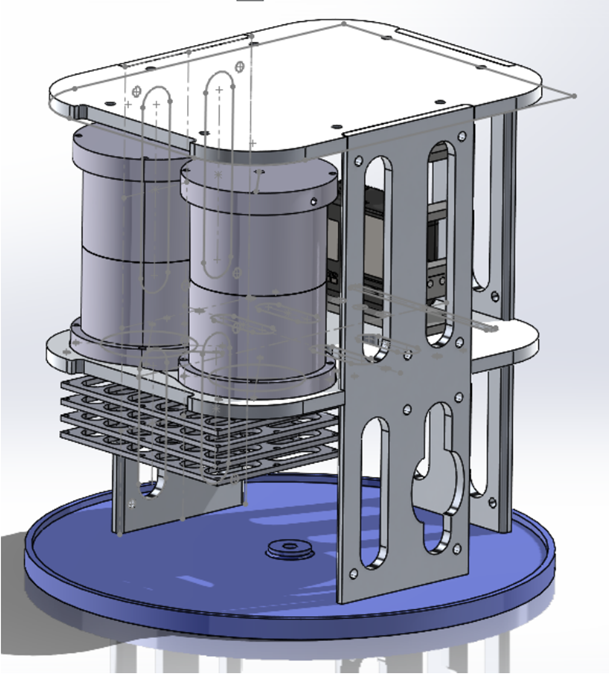
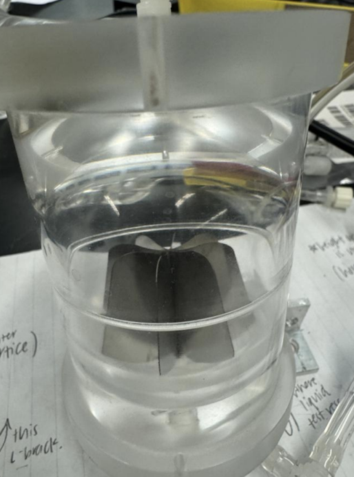
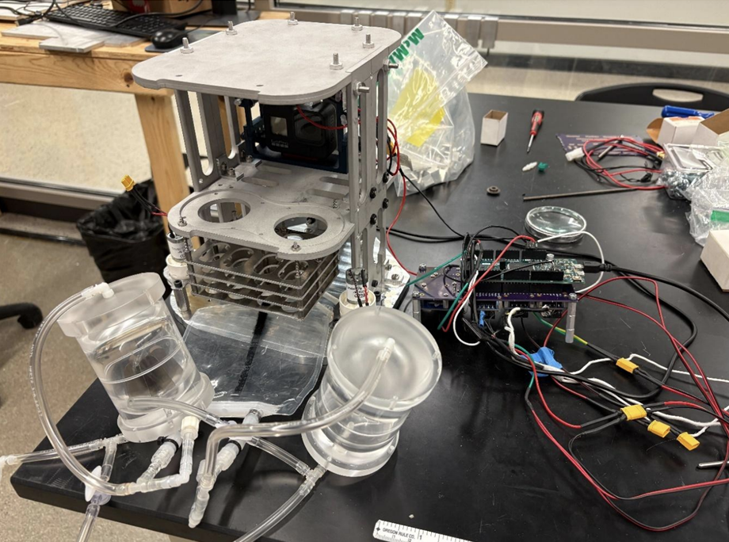
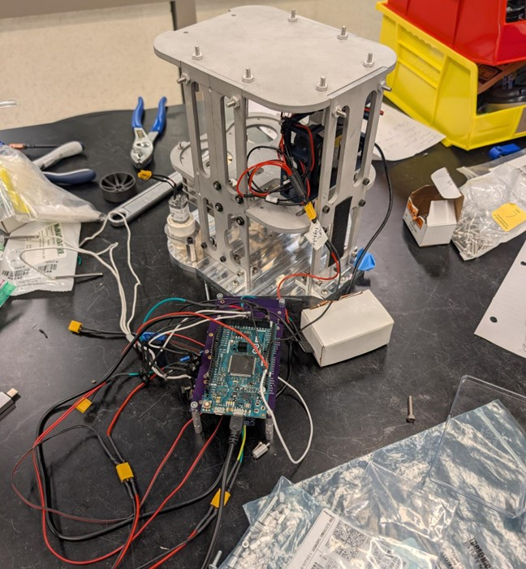
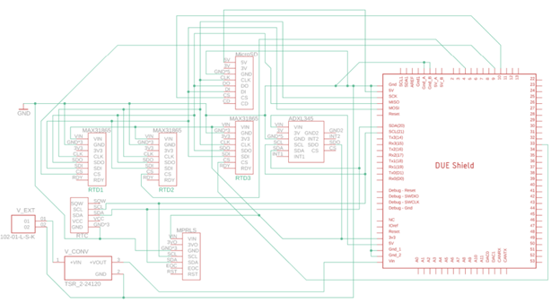
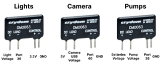

# PRIME
*Purdue Rocket Instrumentation and Measurement Experiment*

## Project Overview  
PRIME is a microgravity fluid-dynamics payload to be launched on a LEAP rocket. The projects goal is to study liquid transfer behavior between coupled tanks in zero gravity. Recent efforts focused on manufacturing key structural components, refining tank geometry, and enhancing electronics and imaging systems. 

## Technical Description  
The PRIME payload investigates fluid dynamics in zero gravity, specifically liquid behavior influenced by internal tank vanes. It consists of two transparent acrylic tanks connected through a sealed plumbing system with pumps that transfer fluid under microgravity conditions. Structurally, the payload employs 6061-T6 aluminum components to withstand launch loads and a mounting system for the GoPro Hero 8 camera. The payload integrates four LEDs for uniform lighting in the unlit rocket bay. Software control sequences are managed by C++ code that triggers sensor activation, lighting, camera recording, and pump operation in timed stages during flight.

## My Role 
*October 2025 - December 2025* 
- Wrote the C++ code to manage the launch sequence, automate sensor and camera activation, and control fluid transfer operations.  
- Resolved hardware-software integration issues to ensure reliable data collection and payload performance.  
- Authored launch documentation to support ongoing development and future team efforts ([Launch Documentation](src/README.md)).  

| | |
|---|---|
|  CAD Assembly |  Vanes in Tank |
|  Structure, Plumbing, Electronic Assembly View1 |  Structure, Plumbing, Electronic Assembly View2 |
|  Circuit Layout  |  Lights, Camera, Pumps Circuit Layout

