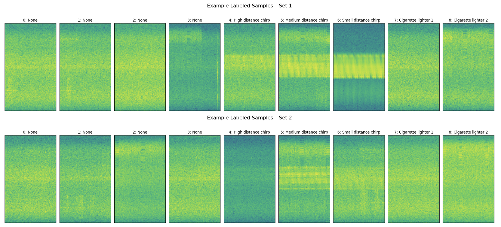
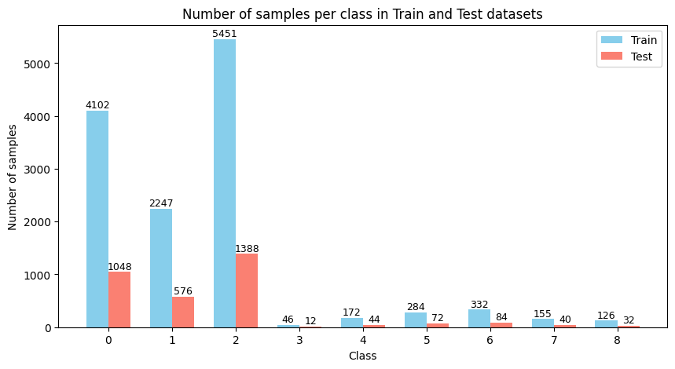

# Radio Frequency Interference Classification Project

### Goal: Develop a model to classify 9 types of RF interference that have occurred along a section of a German highway.

### Dataset: https://gitlab.cc-asp.fraunhofer.de/darcy_gnss/fiot_highway2

#### Example Samples:

#### Samples Distribution:

# CNN
CNN0to8 (with and without extra data, various depths, resized, and not resized)

dropuout (time/freq bins) rectange, shallow vs deep, resize
table

# Decision Tree CNN

# Voting (NN and Linear)

info on highway dataset -> superfeatures1 (transform_specto)

visualization of spreads and such ...
parameterized features useing mean, std, ...

# Future Improvements
* Use more instances of classes 1,3,8 that exist in highway dataset 1.
* Use better ways of creating artificial 1,3,8 samples.

