# Radio Frequency Interference Classification Project

Develop models to classify 9 types of RF interference that occurred along a section of a German highway.

## Dataset

### Example Samples

  

### Samples Distribution

  

### Source
https://gitlab.cc-asp.fraunhofer.de/darcy_gnss/fiot_highway2

## CNN 

I developed four CNN models with varying depths and noise augmentation to serve as baselines for this project, establishing a foundation for future improvements. These models aim to address class imbalance and reduce overfitting. While they achieve strong overall accuracy, they struggle to correctly classify class 1 and the minority classes (3–8), with particularly poor performance on classes 3 and 8.

### Tested Models
<table align="center" style="border-collapse: collapse; width: 100%; max-width: 100%;">
  <thead>
    <tr>
      <th style="text-align:left; border-bottom: 1px solid #ccc; padding: 8px;">Model</th>
      <th style="text-align:left; border-bottom: 1px solid #ccc; padding: 8px;">Description</th>
      <th style="text-align:center; border-bottom: 1px solid #ccc; padding: 8px;">Accuracy</th>
      <th style="text-align:center; border-bottom: 1px solid #ccc; padding: 8px;">Loss</th>
      <th style="border-bottom: 1px solid #ccc; padding: 8px;">Notes</th>
    </tr>
  </thead>
  <tbody>
    <tr>
      <td style="padding: 8px;">CNN shallow</td>
      <td style="padding: 8px;">no augmented, 10 epochs, 1.1 M params</td>
      <td style="text-align:center; padding: 8px;">75.9%</td>
      <td style="text-align:center; padding: 8px;">0.6349</td>
      <td style="padding: 8px;">0% class 3, 0% class 8</td>
    </tr>
    <tr>
      <td style="padding: 8px;">CNN shallow</td>
      <td style="padding: 8px;">noise classes [1 3] samples [100 100], 10 epochs, 1.1 M params</td>
      <td style="text-align:center; padding: 8px;">78.9%</td>
      <td style="text-align:center; padding: 8px;">0.5476</td>
      <td style="padding: 8px;">0% class 3, 0% class 8</td>
    </tr>
    <tr>
      <td style="padding: 8px;">CNN deep</td>
      <td style="padding: 8px;">no augmented, 10 epochs, 4.3 M params</td>
      <td style="text-align:center; padding: 8px;">78.9%</td>
      <td style="text-align:center; padding: 8px;">0.5474</td>
      <td style="padding: 8px;">0% class 3, 0% class 8</td>
    </tr>
    <tr>
      <td style="padding: 8px;">CNN deep</td>
      <td style="padding: 8px;">noise classes [1 3] samples [100 100], 10 epochs, 4.3 M params</td>
      <td style="text-align:center; padding: 8px;">79.4%</td>
      <td style="text-align:center; padding: 8px;">0.5343</td>
      <td style="padding: 8px;">0% class 3, 0% class 8</td>
    </tr>
  </tbody>
</table>

### Best Model

<table align="center" style="border-collapse: collapse; width: 100%; max-width: 100%;">
  <thead>
    <tr>
      <th style="text-align:left; border-bottom: 1px solid #ccc; padding: 8px;">Model</th>
      <th style="text-align:left; border-bottom: 1px solid #ccc; padding: 8px;">Description</th>
      <th style="text-align:center; border-bottom: 1px solid #ccc; padding: 8px;">Accuracy</th>
      <th style="text-align:center; border-bottom: 1px solid #ccc; padding: 8px;">Loss</th>
      <th style="border-bottom: 1px solid #ccc; padding: 8px;">Notes</th>
    </tr>
  </thead>
  <tbody>
    <tr>
      <td style="padding: 8px;">CNN deep</td>
      <td style="padding: 8px;">noise classes [1 3] samples [100 100], 10 epochs, 4.3 M params</td>
      <td style="text-align:center; padding: 8px;">79.4%</td>
      <td style="text-align:center; padding: 8px;">0.5343</td>
      <td style="padding: 8px;">0% class 3, 0% class 8</td>
    </tr>
  </tbody>
</table>

  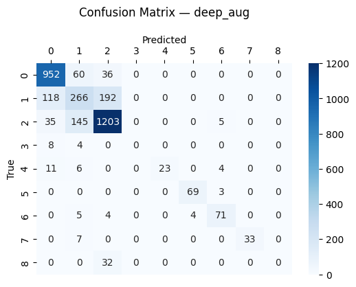
  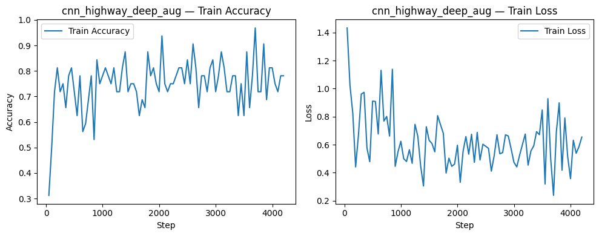

## Decision Tree CNN

I developed a hierarchical (decision-tree-style) CNN architecture to address class imbalance and poor minority-class performance, particularly for classes 3–8. The approach decomposed the task into a binary classifier followed by sub-classifiers (0–3 and 3–8). While the 3–8 classifier achieved strong performance in isolation, the overall system was limited by the binary classifier’s inability to reliably detect classes 3 and 8, rendering downstream accuracy ineffective. This method did not prove to be significantly better than the standard CNN.

### Example Augmented Samples

| Time & Freq Bins Dropout | Rectangle Dropout | Noise |
| :---: | :---: | :---: |
| 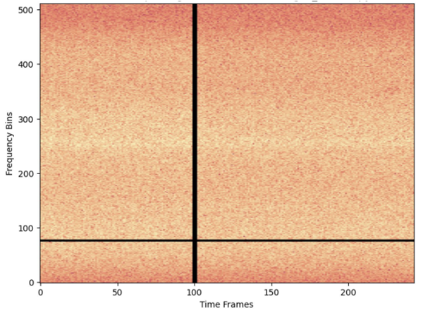 | 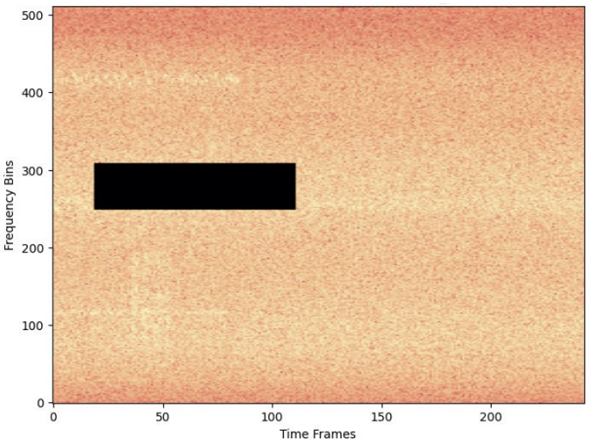 | 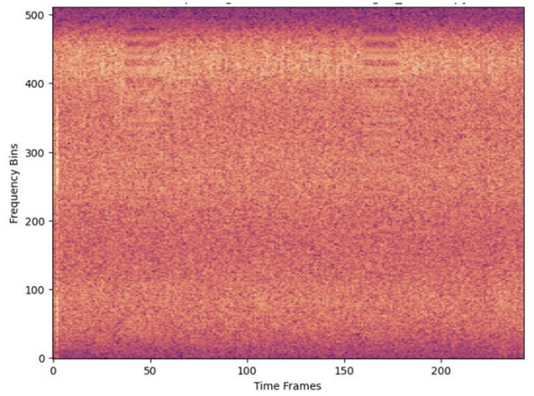 |

### Tested Models
<table align="center" style="border-collapse: collapse; width: 100%; max-width: 100%;">
  <thead>
    <tr>
      <th style="text-align:left; border-bottom: 1px solid #ccc; padding: 8px;">Model</th>
      <th style="text-align:left; border-bottom: 1px solid #ccc; padding: 8px;">Description</th>
      <th style="text-align:center; border-bottom: 1px solid #ccc; padding: 8px;">Accuracy</th>
      <th style="text-align:center; border-bottom: 1px solid #ccc; padding: 8px;">Loss</th>
      <th style="border-bottom: 1px solid #ccc; padding: 8px;">Notes</th>
    </tr>
  </thead>
  <tbody>
    <tr>
      <td style="padding: 8px;">CNN Binary</td>
      <td style="padding: 8px;">no augmented, 8 epochs, 4.3 M params</td>
      <td style="text-align:center; padding: 8px;">97.5%</td>
      <td style="text-align:center; padding: 8px;">0.0879</td>
      <td style="padding: 8px;">0% class 3, 6% class 8</td>
    </tr>
    <tr>
      <td style="padding: 8px;">CNN Binary</td>
      <td style="padding: 8px;">no augmented, 8 epochs, 547 M params</td>
      <td style="text-align:center; padding: 8px;">97.1%</td>
      <td style="text-align:center; padding: 8px;">0.0963</td>
      <td style="padding: 8px;">0% class 3, 0% class 8</td>
    </tr>
    <tr>
      <td style="padding: 8px;">CNN Binary</td>
      <td style="padding: 8px;">time & freq dropout classes [3 ... 8] samples [100], 8 epochs, 4.3 M params</td>
      <td style="text-align:center; padding: 8px;">96.0%</td>
      <td style="text-align:center; padding: 8px;">0.1696</td>
      <td style="padding: 8px;">0% class 3, 0% class 8</td>
    </tr>
    <tr>
      <td style="padding: 8px;">CNN 0to3</td>
      <td style="padding: 8px;">rect dropout classes [1 3] samples [100 100], 8 epochs, 524 K params</td>
      <td style="text-align:center; padding: 8px;">77.4%</td>
      <td style="text-align:center; padding: 8px;">0.5549</td>
      <td style="padding: 8px;">0% class 3</td>
    </tr>
    <tr>
      <td style="padding: 8px;">CNN 0to3</td>
      <td style="padding: 8px;">rect dropout classes [1 3] samples [100 100], 8 epochs, 548 K params</td>
      <td style="text-align:center; padding: 8px;">77.7%</td>
      <td style="text-align:center; padding: 8px;">0.5275</td>
      <td style="padding: 8px;">0% class 3</td>
    </tr>
    <tr>
      <td style="padding: 8px;">CNN 0to3</td>
      <td style="padding: 8px;">rect dropout classes [1 3] samples [1000 200], 8 epochs, 548 K params</td>
      <td style="text-align:center; padding: 8px;">74.0%</td>
      <td style="text-align:center; padding: 8px;">0.6857</td>
      <td style="padding: 8px;">0% class 3</td>
    </tr>
    <tr>
      <td style="padding: 8px;">CNN 0to3</td>
      <td style="padding: 8px;">time & freq dropout classes [1 3] samples [200 500], 8 epochs, 4.3 M params</td>
      <td style="text-align:center; padding: 8px;">79.3%</td>
      <td style="text-align:center; padding: 8px;">0.5242</td>
      <td style="padding: 8px;">0% class 3</td>
    </tr>
    <tr>
      <td style="padding: 8px;">CNN 0to3</td>
      <td style="padding: 8px;">no augmented, 8 epochs, 4.3 M params</td>
      <td style="text-align:center; padding: 8px;">79.1%</td>
      <td style="text-align:center; padding: 8px;">0.5482</td>
      <td style="padding: 8px;">0% class 3</td>
    </tr> 
    <tr>
      <td style="padding: 8px;">CNN 3to8</td>
      <td style="padding: 8px;">no augmented, 8 epochs, 4.3 M params</td>
      <td style="text-align:center; padding: 8px;">87.7%</td>
      <td style="text-align:center; padding: 8px;">0.2713</td>
      <td style="padding: 8px;">50% class 3, 100% class 8</td>
    </tr>
    <tr>
      <td style="padding: 8px;">CNN 3to8</td>
      <td style="padding: 8px;">time & freq dropout classes [3] samples [20], 12 epochs, 4.3 M params</td>
      <td style="text-align:center; padding: 8px;">91.5%</td>
      <td style="text-align:center; padding: 8px;">0.2425</td>
      <td style="padding: 8px;">100% class 3, 100% class 8</td>
    </tr>
    <tr>
      <td style="padding: 8px;">CNN 3to8</td>
      <td style="padding: 8px;">time & freq dropout classes [all] samples [20 each], 12 epochs, 4.3 M params</td>
      <td style="text-align:center; padding: 8px;">95.9%</td>
      <td style="text-align:center; padding: 8px;">0.1289</td>
      <td style="padding: 8px;">83% class 3, 100% class 8</td>
    </tr>
    <tr>
      <td style="padding: 8px;">CNN 3to8</td>
      <td style="padding: 8px;">time & freq dropout classes [3, all] samples [50, 15 each], 15 epochs, 4.3 M params</td>
      <td style="text-align:center; padding: 8px;">91.5%</td>
      <td style="text-align:center; padding: 8px;">0.1849</td>
      <td style="padding: 8px;">42% class 3, 100% class 8</td>
    </tr>
  </tbody>
</table>

### Best Model
<table align="center" style="border-collapse: collapse; width: 100%; max-width: 100%;">
  <thead>
    <tr>
      <th style="text-align:left; border-bottom: 1px solid #ccc; padding: 8px;">Model</th>
      <th style="text-align:left; border-bottom: 1px solid #ccc; padding: 8px;">Description</th>
      <th style="text-align:center; border-bottom: 1px solid #ccc; padding: 8px;">Accuracy</th>
      <th style="text-align:center; border-bottom: 1px solid #ccc; padding: 8px;">Loss</th>
      <th style="border-bottom: 1px solid #ccc; padding: 8px;">Notes</th>
    </tr>
  </thead>
  <tbody>
    <tr>
      <td style="padding: 8px;">CNN Binary</td>
      <td style="padding: 8px;">no augmented, 8 epochs, 4.3 M params</td>
      <td style="text-align:center; padding: 8px;">97.5%</td>
      <td style="text-align:center; padding: 8px;">0.0879</td>
      <td style="padding: 8px;">0% class 3, 6% class 8</td>
    </tr>
    <tr>
      <td style="padding: 8px;">CNN 0to3</td>
      <td style="padding: 8px;">time & freq dropout classes [1 3] samples [200 500], 8 epochs, 4.3 M params</td>
      <td style="text-align:center; padding: 8px;">79.3%</td>
      <td style="text-align:center; padding: 8px;">0.5242</td>
      <td style="padding: 8px;">0% class 3</td>
    </tr>
    <tr>
      <td style="padding: 8px;">CNN 3to8</td>
      <td style="padding: 8px;">time & freq dropout classes [all] samples [20 each], 12 epochs, 4.3 M params</td>
      <td style="text-align:center; padding: 8px;">95.9%</td>
      <td style="text-align:center; padding: 8px;">0.1289</td>
      <td style="padding: 8px;">83% class 3, 100% class 8</td>
    </tr>
  </tbody>
</table>

| Binary | 0 to 3 | 3 to 8 |
| :---: | :---: | :---: |
| 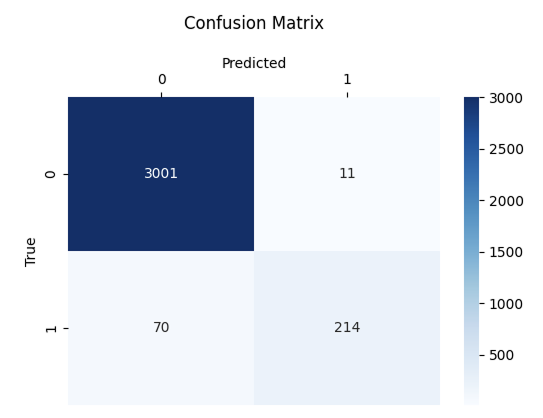 | 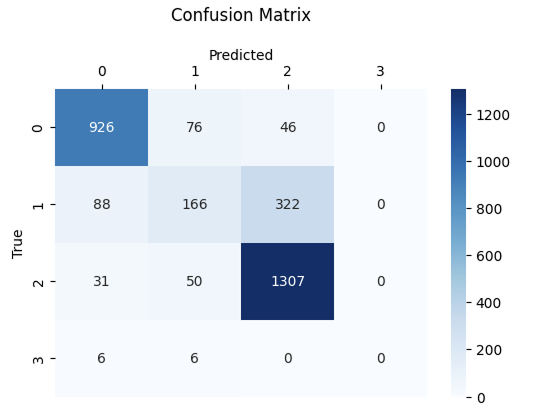 | 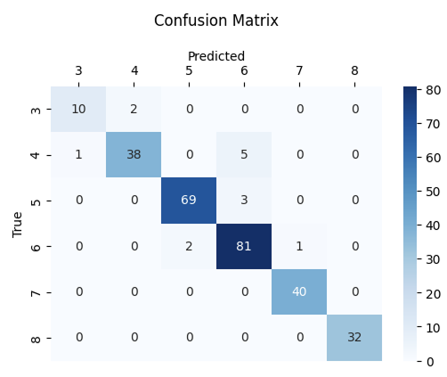 |

## NN 
The samples in highway dataset are mainly variations of noise with some noticable signal patterns mixed in. The location of the signal in the spectogram does not seem to be the driving decision maker. Consequently, it is hypothezied that each spectogram can be described as a set of "superfeatures" that encode a statistical parameter (mean, median, std, ...). This will reduce the size of the dataset and could help the models focus on the most descriptive data. These superfeatures will be used to train a neural network model. This method proved to be slightly more accurate than the CNN models but trained 10x faster.

### Superfeatures
Each sample in the highway dataset is trainsformed into 1344 features.
- Shift spectrogram values from **[-136, 0]** to **[0, 136]**
- Resize spectrogram from **512 × 243** to **128 × 64**
- Extract statistical features across rows and columns:
  - Mean
  - Standard deviation
  - Median
  - Minimum and maximum
  - Minimum and maximum locations
- Normalize all features using either:
  - norm0to1: scale onto **[0, 1]**
  - normz: scale using **z-score**

  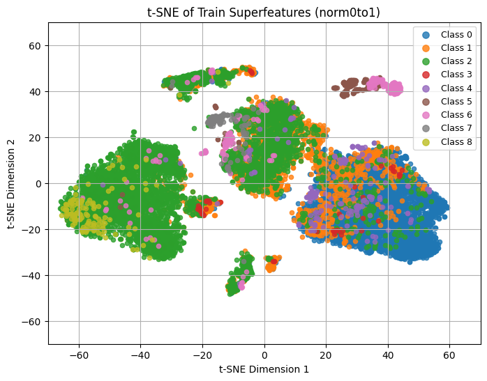

### Tested Models
<table align="center" style="border-collapse: collapse; width: 100%; max-width: 100%;">
  <thead>
    <tr>
      <th style="text-align:left; border-bottom: 1px solid #ccc; padding: 8px;">Model</th>
      <th style="text-align:left; border-bottom: 1px solid #ccc; padding: 8px;">Description</th>
      <th style="text-align:center; border-bottom: 1px solid #ccc; padding: 8px;">Accuracy</th>
      <th style="text-align:center; border-bottom: 1px solid #ccc; padding: 8px;">Loss</th>
    </tr>
  </thead>
  <tbody>
    <tr>
      <td style="padding: 8px;">run2 cell1</td>
      <td style="padding: 8px;">superfeatures (norm0to1), 25 epochs, 822 K params</td>
      <td style="text-align:center; padding: 8px;">79.6%</td>
      <td style="text-align:center; padding: 8px;">0.5428</td>
    </tr>
    <tr>
      <td style="padding: 8px;">run2 cell2</td>
      <td style="padding: 8px;">superfeatures (norm0to1), 25 epochs, 2.1 M params</td>
      <td style="text-align:center; padding: 8px;">78.8%</td>
      <td style="text-align:center; padding: 8px;">0.5576</td>
    </tr>
    <tr>
      <td style="padding: 8px;">run2 cell3</td>
      <td style="padding: 8px;">superfeatures (normz), 25 epochs, 2.1 M params</td>
      <td style="text-align:center; padding: 8px;">74.6%</td>
      <td style="text-align:center; padding: 8px;">1.3018</td>
    </tr>
    <tr>
      <td style="padding: 8px;">run3 cell1</td>
      <td style="padding: 8px;">run2 cell1 with 35 epoch</td>
      <td style="text-align:center; padding: 8px;">77.0%</td>
      <td style="text-align:center; padding: 8px;">.6341</td>
    </tr>
    <tr>
      <td style="padding: 8px;">run3 cell2</td>
      <td style="padding: 8px;">run2 cell1 with 45 epoch</td>
      <td style="text-align:center; padding: 8px;">78.7%</td>
      <td style="text-align:center; padding: 8px;">.6800</td>
    </tr>
    <tr>
      <td style="padding: 8px;">run3 cell3</td>
      <td style="padding: 8px;">run2 cell2 with 50 epoch</td>
      <td style="text-align:center; padding: 8px;">79.6%</td>
      <td style="text-align:center; padding: 8px;">0.7010</td>
    </tr>
    <tr>
      <td style="padding: 8px;">run3 cell4</td>
      <td style="padding: 8px;">run2 cell3 with 50 epoch</td>
      <td style="text-align:center; padding: 8px;">76.9%</td>
      <td style="text-align:center; padding: 8px;">1.7880</td>
    </tr>
    <tr>
      <td style="padding: 8px;">nn_exp2 cell2</td>
      <td style="padding: 8px;">superfeatures (norm0to1), time mixup class 3, 8 epoch, 1.4 M params </td>
      <td style="text-align:center; padding: 8px;">79.8%</td>
      <td style="text-align:center; padding: 8px;">0.5441</td>
    </tr>
    <tr>
      <td style="padding: 8px;">nn_exp2 cell3</td>
      <td style="padding: 8px;">nn_exp2 cell2 with weights [1/10,1/10,1/10,1,1,1,1,1,1] </td>
      <td style="text-align:center; padding: 8px;">75.1%</td>
      <td style="text-align:center; padding: 8px;">0.5578</td>
    </tr>
  </tbody>
</table>

### Best NN Models
<table align="center" style="border-collapse: collapse; width: 100%; max-width: 100%;">
  <thead>
    <tr>
      <th style="text-align:left; border-bottom: 1px solid #ccc; padding: 8px;">Model</th>
      <th style="text-align:left; border-bottom: 1px solid #ccc; padding: 8px;">Description</th>
      <th style="text-align:center; border-bottom: 1px solid #ccc; padding: 8px;">Accuracy</th>
      <th style="text-align:center; border-bottom: 1px solid #ccc; padding: 8px;">Loss</th>
    </tr>
  </thead>
  <tbody>
    <tr>
      <td style="padding: 8px;">run2 cell1</td>
      <td style="padding: 8px;">superfeatures, 25 epochs, 822 K params</td>
      <td style="text-align:center; padding: 8px;">79.6%</td>
      <td style="text-align:center; padding: 8px;">0.5428</td>
    </tr>
  </tbody>
</table>

 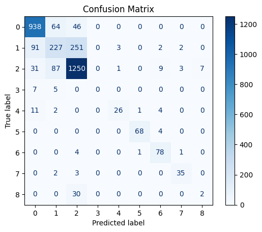

 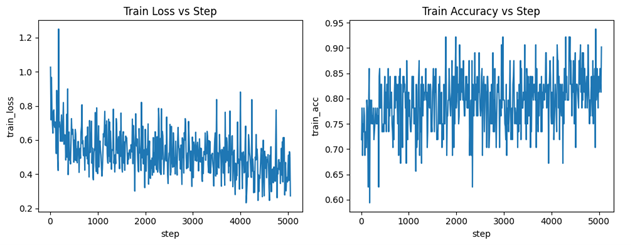

<table align="center" style="border-collapse: collapse; width: 100%; max-width: 100%;">
  <thead>
    <tr>
      <th style="text-align:left; border-bottom: 1px solid #ccc; padding: 8px;">Model</th>
      <th style="text-align:left; border-bottom: 1px solid #ccc; padding: 8px;">Description</th>
      <th style="text-align:center; border-bottom: 1px solid #ccc; padding: 8px;">Accuracy</th>
      <th style="text-align:center; border-bottom: 1px solid #ccc; padding: 8px;">Loss</th>
    </tr>
  </thead>
  <tbody>
    <tr>
      <td style="padding: 8px;">nn_exp2 cell2</td>
      <td style="padding: 8px;">superfeatures (norm0to1), time mixup class 3, 8 epoch, 1.4 M params </td>
      <td style="text-align:center; padding: 8px;">79.8%</td>
      <td style="text-align:center; padding: 8px;">0.5441</td>
    </tr>
    <tr>
  </tbody>
</table>

 

 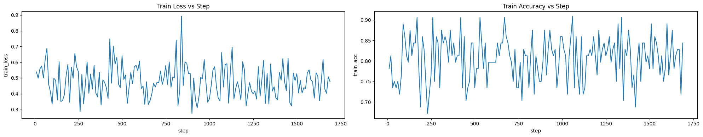

## Voting 
The idea behind the voting model is to pair a set of neural network models, that consistently struggle with classes 1,3,8 (similar to CNN) with a model that is better with 1,3,8 but struggles with classes 0,2. 

To achieve this, a set of neural network and "linear" models were trained on variations of the highway dataset. Each model, when given a sample, outputs a set of probabilities for each class. 

Two different voting techniques were utilized: unfited voting and fited voting. Unfited voting sums the probabilites across models at each class, creating a final set of scores for each class. The class corresponding to the largest score is chosen as the final class. Alternativly, fited voting uses the set of probabilites for each model as features for a NN that predicts the final class. 

In the analysis of this model multiple guesses are shown. With one guess, the prediction is correct if the best prediction matches the test class. Two guesess considers a prediciton correct if the best or second best prediction matches the test class. This is done to show a higher accuracy which makes me feel better. The multiple guess confusion matrix can help quantify the classification difficulty based on how many guesses are needed.

Ultimately, this method did not offer any improvement from the standard NN.

### Superfeatures
Each sample in the highway dataset is trainsformed into 2112 features.
- Shift spectrogram values from **[-136, 0]** to **[0, 136]**
- Resize spectrogram from **512 × 243** to **128 × 64**
- Extract statistical features across rows and columns:
  - Mean
  - Standard deviation
  - Median
  - Minimum and maximum
  - Minimum and maximum locations
  - 75th and 25th percentiles
  - 90th and 10th percentiles
- Normalize all features to the range **[0, 1]**

  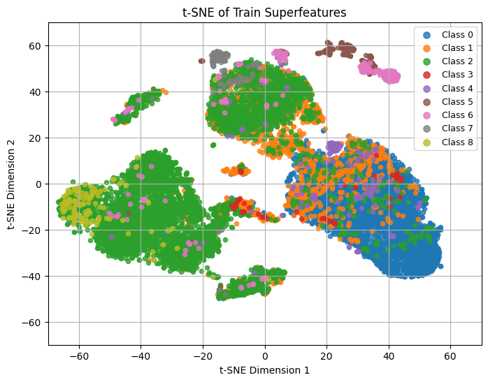

### Example NN Model
This represents the typical results when evaluating neural network models. This has an accuracy of **77.1%** after one guess and **94.9%** after two guesses. 

  

These models perform similarly to the CNN-based models, despite using superfeatures rather than normalized spectrogram data, suggesting that the superfeatures adequately describe the dataset.

### Example "Linear" Model 
> A "linear" model is trained by finding the median and standard deviation at each feature, independently computed for each class.  
> **classes** c1 ... c9  
> **features** x1 ... xn  
> **medians** m1 ... mn for all c  
> **standard deviations** s1 ... sn for all c  
> Given the features of a sample to evaluate, compute the z-score at each feature, independently compute for each class.  
> **sample z-scores** z1 ... zn for all c  
> Average z-scores across each class to get one score for each class.  
> **sample scores** b1 ... b9  
> Convert scores into probabilities with: exp(-bi) / sum(exp(-b))  
> **sample probabilities** p1 ... p9  

This represents the typical results when evaluating "linear" models. This has an accuracy of **63.7%** after one guess and **79.8%** after two guesses. 

  

This model has a higher success rate with classifiying minority classes 3,4,5,6,7,8 with the tradoff of having more misclassification of 0,1,2.

### Voting Models
<table align="center" style="border-collapse: collapse; width: 100%; max-width: 100%;">
  <thead>
    <tr>
      <th style="text-align:left; border-bottom: 1px solid #ccc; padding: 8px;">Model</th>
      <th style="text-align:left; border-bottom: 1px solid #ccc; padding: 8px;">Description</th>
      <th style="text-align:center; border-bottom: 1px solid #ccc; padding: 8px;">Accuracy Guess 1</th>
      <th style="text-align:center; border-bottom: 1px solid #ccc; padding: 8px;">Accuracy Guess 2</th>
    </tr>
  </thead>
  <tbody>
    <tr>
      <td style="padding: 8px;">NN1</td>
      <td style="padding: 8px;">superfeatures, 8 epochs, 1.2 M params</td>
      <td style="text-align:center; padding: 8px;">78.2%</td>
      <td style="text-align:center; padding: 8px;">95.4%</td>
    </tr>
    <tr>
      <td style="padding: 8px;">NN2</td>
      <td style="padding: 8px;">superfeatures, 8 epochs, 2.0 M params</td>
      <td style="text-align:center; padding: 8px;">78.8%</td>
      <td style="text-align:center; padding: 8px;">95.7%</td>
    </tr>
    <tr>
      <td style="padding: 8px;">NN3</td>
      <td style="padding: 8px;">superfeatures, 6 epochs, 5.5 M params</td>
      <td style="text-align:center; padding: 8px;">78.0%</td>
      <td style="text-align:center; padding: 8px;">95.8%</td>
    </tr>
    <tr>
      <td style="padding: 8px;">Linear1</td>
      <td style="padding: 8px;">superfeatures</td>
      <td style="text-align:center; padding: 8px;">63.6%</td>
      <td style="text-align:center; padding: 8px;">80.3%</td>
    </tr>
    <tr>
      <td style="padding: 8px;">Linear2</td>
      <td style="padding: 8px;">superfeatures (no mean, std)</td>
      <td style="text-align:center; padding: 8px;">63.7%</td>
      <td style="text-align:center; padding: 8px;">79.8%</td>
    </tr>
    <tr>
      <td style="padding: 8px;">Linear3</td>
      <td style="padding: 8px;">superfeatures (no mean, std, 90th &amp; 10th percentiles)</td>
      <td style="text-align:center; padding: 8px;">63.6%</td>
      <td style="text-align:center; padding: 8px;">80.0%</td>
    </tr>
  </tbody>
</table>

### Unfited Voter Results
<table align="center" style="border-collapse: collapse; width: 100%; max-width: 100%;">
  <thead>
    <tr>
      <th style="text-align:center; padding: 8px;">Model</th>
      <th style="text-align:center; padding: 8px;">Accuracy Guess 1</th>
      <th style="text-align:center; padding: 8px;">Accuracy Guess 2</th>
    </tr>
  </thead>
  <tbody>
    <tr>
      <td style="text-align:center; padding: 8px;">Unfited Voter</td>
      <td style="text-align:center; padding: 8px;">77.7%</td>
      <td style="text-align:center; padding: 8px;">94.3%</td>
    </tr>
  </tbody>
</table>

  

### Fited Voter Results

<table align="center" style="border-collapse: collapse; width: 100%; max-width: 100%;">
  <thead>
    <tr>
      <th style="text-align:center; padding: 8px;">Model</th>
      <th style="text-align:center; padding: 8px;">Description</th>
      <th style="text-align:center; padding: 8px;">Accuracy Guess 1</th>
      <th style="text-align:center; padding: 8px;">Accuracy Guess 2</th>
      <th style="text-align:center; padding: 8px;">Loss</th>
    </tr>
  </thead>
  <tbody>
    <tr>
      <td style="text-align:center; padding: 8px;">Fited Voter</td>
      <td style="text-align:center; padding: 8px;">17.7 K params</td>
      <td style="text-align:center; padding: 8px;">78.2%</td>
      <td style="text-align:center; padding: 8px;">95.7%</td>
      <td style="text-align:center; padding: 8px;">0.5565</td>
    </tr>
  </tbody>
</table>

  

<!-- 

  <table style="width: 100%; border-collapse: collapse; border: 1px solid #ccc;">
    <thead>
      <tr>
        <th style="text-align:left; border-bottom: 1px solid #ccc; padding: 8px;">Metric</th>
        <th style="text-align:center; border-bottom: 1px solid #ccc; padding: 8px;">Value</th>
      </tr>
    </thead>
    <tbody>
      <tr>
        <td style="text-align:left; padding: 8px;">Test Loss</td>
        <td style="text-align:center; padding: 8px;">0.5565</td>
      </tr>
      <tr>
        <td style="text-align:left; padding: 8px;">Params</td>
        <td style="text-align:center; padding: 8px;">17.7 K</td>
      </tr>
    </tbody>
  </table>

 -->
 

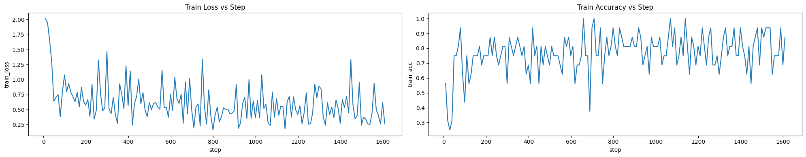

## Future Improvements
* Use more instances of classes 1,3,8 that exist in highway dataset 1.
* Use better ways of creating artificial 1,3,8 samples.
* Further explore nn with different augmentations.
* Use existing image classification models.

